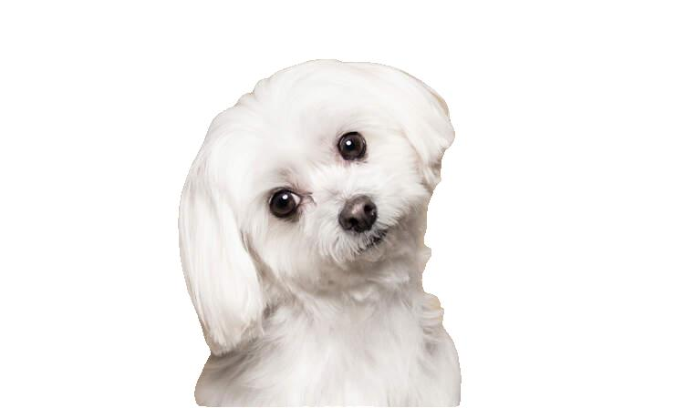
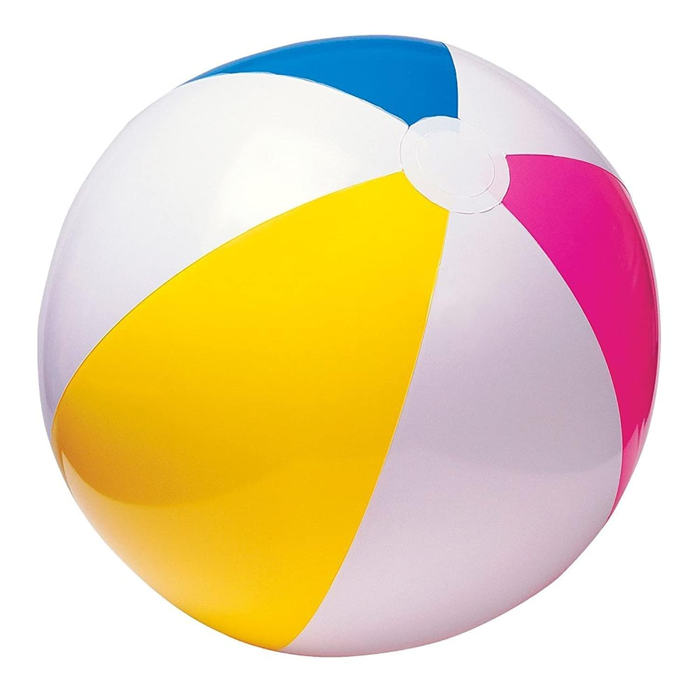
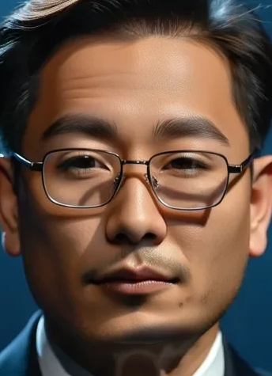
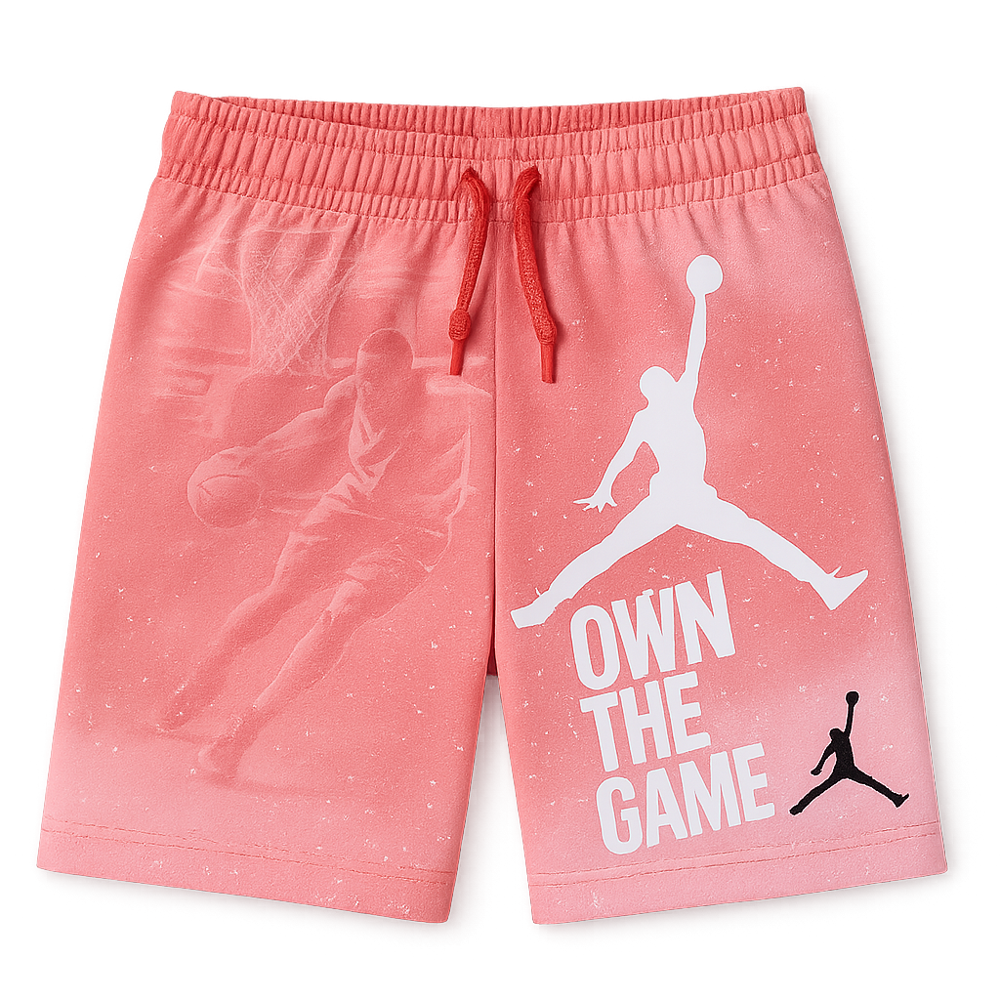

<div align="center">
  
</div>

<h1 align="center">🚀 RefAlign: Representation Alignment for Reference-to-Video Generation</h1>

<h5 align="center"> If you like our project, please give us a star ⭐ on GitHub for the latest update.  </h2>

<p align="center">
  <b>arXiv 2026</b><br>
  A training-time alignment framework for improving <b>reference fidelity</b>, <b>identity consistency</b>, and <b>text controllability</b> in reference-to-video generation.
</p>

<p align="center">
  <a href="https://arxiv.org/abs/2603.25743"></a>
  <a href="https://arxiv.org/pdf/2603.25743"></a>
  <a href="https://gudaochangsheng.github.io/RefAlign-Page/"></a>
  <a href="https://github.com/gudaochangsheng/RefAlign"></a>
  
</p>

<p align="center">
  <a href="https://huggingface.co/gudaochangsheng/RefAlign-1.3B"></a>
  <a href="https://huggingface.co/gudaochangsheng/RefAlign-14B"></a>
  <a href="https://www.modelscope.cn/models/gudaochangsheng98/RefAlign-1.3B"></a>
  <a href="https://www.modelscope.cn/models/gudaochangsheng98/RefAlign-14B"></a>
</p>

<div align="center">
  <a href="https://gudaochangsheng.github.io/">Lei Wang</a><sup>1,2,*,‡</sup>,
  <a href="https://scholar.google.com/citations?hl=zh-TW&user=1uL_9HAAAAAJ">Yuxin Song</a><sup>2,‡</sup>,
  <a href="https://github.com/Martinser">Ge Wu</a><sup>1</sup>,
  <a href="https://scholar.google.com.hk/citations?user=pnuQ5UsAAAAJ&hl=zh-CN&oi=ao">Haocheng Feng</a><sup>2</sup>,
  <a href="https://hangz-nju-cuhk.github.io/">Hang Zhou</a><sup>2</sup>,
  <a href="https://jingdongwang2017.github.io/">Jingdong Wang</a><sup>2</sup>,
  <a href="https://yaxingwang.github.io/">Yaxing Wang</a><sup>4†</sup>,
  <a href="https://scholar.google.com.hk/citations?user=6CIDtZQAAAAJ&hl=en">Jian Yang</a><sup>1,3†</sup>
</div>

<div align="center">
  <sup>1</sup> PCA Lab, VCIP, College of Computer Science, Nankai University &nbsp;&nbsp;
  <sup>2</sup> Baidu Inc. &nbsp;&nbsp;
  <sup>3</sup> PCA Lab, School of Intelligence Science and Technology, Nanjing University &nbsp;&nbsp;
  <sup>4</sup> College of Artificial Intelligence, Jilin University
</div>

<div align="center">
  † Corresponding authors &nbsp;&nbsp; * Interns at Baidu Inc. &nbsp;&nbsp; ‡ Equal contribution
</div>

---

## 🔥 Why RefAlign?

Reference-to-video (R2V) generation often suffers from two practical issues:

- **copy-paste artifacts**
- **multi-subject confusion**

RefAlign addresses these issues by explicitly aligning **DiT reference-branch features** to the feature space of a frozen **visual foundation model (VFM)** during training.

### Key advantages

- **Better reference fidelity**
- **Improved identity consistency**
- **Stronger semantic discrimination**
- **No inference-time overhead**
- **State-of-the-art results on OpenS2V-Eval**

> In short: **RefAlign improves reference-consistent video generation through explicit representation alignment.**

---

## 🏆 Highlights

- RefAlign achieves **state-of-the-art performance** on [OpenS2V-Eval](https://huggingface.co/spaces/BestWishYsh/OpenS2V-Eval).
- We release both **1.3B** and **14B** checkpoints.
- The method is applied **only during training**, so the alignment module and VFM are discarded at inference time.
- RefAlign outperforms strong **open-source** baselines and is competitive with / better than several **closed-source** systems.

---

## 🖼️ Overview

<div align="center">
  
</div>

---

## 🎬 Demo

| Reference Images | Output Video |
|---|---|
|    | <video src="https://github.com/user-attachments/assets/7258ac74-c091-4f64-a48e-f8bcb28ab5e9" autoplay muted loop playsinline></video><br><a href="https://github.com/user-attachments/assets/7258ac74-c091-4f64-a48e-f8bcb28ab5e9">Open Video</a> |
|    | <video src="https://github.com/user-attachments/assets/202913a2-ae02-4754-9bde-03c061480e38" autoplay muted loop playsinline></video><br><a href="https://github.com/user-attachments/assets/202913a2-ae02-4754-9bde-03c061480e38">Open Video</a> |
|    | <video src="https://github.com/user-attachments/assets/55e6e24a-00c1-40e4-bf17-adbdf2677370" autoplay muted loop playsinline></video><br><a href="https://github.com/user-attachments/assets/55e6e24a-00c1-40e4-bf17-adbdf2677370">Open Video</a> |
|    | <video src="https://github.com/user-attachments/assets/3ae56259-0f3f-4d41-a1a2-59f919ab1c2c" autoplay muted loop playsinline></video><br><a href="https://github.com/user-attachments/assets/3ae56259-0f3f-4d41-a1a2-59f919ab1c2c">Open Video</a> |

---

## 🏆 OpenS2V-Eval Leaderboard

> RefAlign achieves **SOTA performance** on [OpenS2V-Eval](https://huggingface.co/spaces/BestWishYsh/OpenS2V-Eval) across multiple metrics.

| Model | Venue | TotalScore ↑ | Aesthetic ↑ | MotionSmoothness ↑ | MotionAmplitude ↑ | FaceSim ↑ | GmeScore ↑ | NexusScore ↑ | NaturalScore ↑ |
|---|---|---:|---:|---:|---:|---:|---:|---:|---:|
| 🥇 **RefAlign-14B (Ours)** | Open-Source | **60.42%** | 46.84% | **97.61%** | 22.48% | **55.23%** | 68.32% | **48.52%** | 73.63% |
| 🥇 **RefAlign-1.3B (Ours)** | Open-Source | **56.30%** | 42.96% | 94.74% | 20.74% | 53.06% | 66.85% | 43.97% | 66.25% |
| Saber | Closed-Source | 57.91% | 42.42% | 96.12% | 21.12% | 49.89% | 67.50% | 47.22% | 72.55% |
| VINO | Open-Source | 57.85% | 45.92% | 94.73% | 12.30% | 52.00% | 69.69% | 42.67% | 71.99% |
| BindWeave | Closed-Source | 57.61% | 45.55% | 95.90% | 13.91% | 53.71% | 67.79% | 46.84% | 66.85% |
| VACE-14B | Open-Source | 57.55% | **47.21%** | 94.97% | 15.02% | 55.09% | 67.27% | 44.08% | 67.04% |
| Phantom-14B | Open-Source | 56.77% | 46.39% | 96.31% | **33.42%** | 51.46% | **70.65%** | 37.43% | 69.35% |
| Kling1.6 | Closed-Source | 56.23% | 44.59% | 86.93% | **41.60%** | 40.10% | 66.20% | 45.89% | **74.59%** |
| Phantom-1.3B | Open-Source | 54.89% | 46.67% | 93.30% | 14.29% | 48.56% | 69.43% | 42.48% | 62.50% |
| MAGREF-480P | Open-Source | 52.51% | 45.02% | 93.17% | 21.81% | 30.83% | 70.47% | 43.04% | 66.90% |
| SkyReels-A2-P14B | Open-Source | 52.25% | 39.41% | 87.93% | 25.60% | 45.95% | 64.54% | 43.75% | 60.32% |
| Vidu2.0 | Closed-Source | 51.95% | 41.48% | 90.45% | 13.52% | 35.11% | 67.57% | 43.37% | 65.88% |

---

## 💡 Motivation

<div align="center">
  
  <br>
  <em>
    Motivation of RefAlign. 
    (a) R2V generation suffers from copy-paste artifacts and multi-subject confusion.
    (b) t-SNE visualization shows that DiT reference features are highly entangled, while DINOv3 features are more separable.
    RefAlign aligns DiT features to the DINOv3 feature space to improve reference separability.
    (c) Visual comparison with and without RefAlign.
  </em>
</div>

---

## 📘 Introduction

Reference-to-video (R2V) generation is a controllable video synthesis setting where both **text prompts** and **reference images** are used to guide video generation. It is useful for applications such as **personalized advertising**, **virtual try-on**, and **identity-consistent video creation**.

Most existing R2V methods introduce additional high-level semantic or cross-modal features on top of the VAE latent representation and jointly feed them into a diffusion Transformer (**DiT**). Although these auxiliary features can provide useful semantic guidance, they often remain insufficient to resolve the modality mismatch across heterogeneous encoders, which leads to issues such as **copy-paste artifacts** and **multi-subject confusion**.

To address this, we propose **RefAlign**, a representation alignment framework that explicitly aligns **DiT reference-branch features** to the semantic space of a frozen **visual foundation model (VFM)**. The core of RefAlign is a **reference alignment loss** that pulls same-subject pairs closer and pushes different-subject pairs farther apart, improving both **identity consistency** and **semantic discriminability**.

RefAlign is used **only during training**, which means the alignment process and the VFM are discarded at inference time, introducing **no extra inference overhead**. Extensive experiments on **OpenS2V-Eval** demonstrate that RefAlign achieves **state-of-the-art TotalScore**, validating the effectiveness of explicit representation alignment for R2V generation.

---

## 🧠 Method

<div align="center">
  
  <br>
  <em>
    (a) Overview of RefAlign. During training, the proposed reference alignment loss is applied to intermediate features in selected DiT blocks and aligns them to target features extracted by a frozen visual foundation model.
    During inference, both the alignment process and the VFM are removed.
    (b) Illustration of the reference alignment loss, which pulls matched pairs together and pushes mismatched pairs apart.
  </em>
</div>

---

## ✨ Qualitative Results

<div align="center">
  <b>Qualitative comparison with existing methods.</b>
</div>

<div align="center">
  
</div>

---

## 📈 Quantitative Results

<p align="center">
  
</p>

---

## ⚡ Quick Start

### Installation

```bash
git clone https://github.com/gudaochangsheng/RefAlign.git
cd RefAlign

conda create -n refalign python=3.8 -y
conda activate refalign

pip install -r requirements.txt
```

### Inference

```bash
# Inference with RefAlign-1.3B
python examples/wanvideo/model_inference/Wan2.1-T2V-1.3B_subject.py

# Inference with RefAlign-14B
python examples/wanvideo/model_inference/Wan2.1-T2V-14B_subject.py
```

---

## 📦 Model Zoo

| Model | Params | Hugging Face | ModelScope |
|---|---:|---|---|
| RefAlign-1.3B | 1.3B | [](https://huggingface.co/gudaochangsheng/RefAlign-1.3B) | [](https://www.modelscope.cn/models/gudaochangsheng98/RefAlign-1.3B) |
| RefAlign-14B | 14B | [](https://huggingface.co/gudaochangsheng/RefAlign-14B) | [](https://www.modelscope.cn/models/gudaochangsheng98/RefAlign-14B) |

---

## 🏋️ Training

```bash
# Train RefAlign-1.3B: stage 1 (OpenS2V)
sh ./examples/wanvideo/model_training/full/Wan2.1-T2V-1.3B_stage1.sh

# Train RefAlign-1.3B: stage 2 (Phantom-Data)
sh ./examples/wanvideo/model_training/full/Wan2.1-T2V-1.3B_stage2.sh

# Train RefAlign-14B: stage 1 (OpenS2V)
sh ./examples/wanvideo/model_training/full/Wan2.1-T2V-14B_stage1.sh

# Train RefAlign-14B: stage 2 (Phantom-Data)
sh ./examples/wanvideo/model_training/full/Wan2.1-T2V-14B_stage2.sh
```

---

## ✅ Updates

- [x] Release paper
- [x] Release project page
- [x] Release 1.3B checkpoint
- [x] Release 14B checkpoint
- [x] Release inference code
- [x] Release training scripts
- [ ] Add more demos
- [ ] Add more ablation results

---

## 📌 Notes

- RefAlign is a **training-time alignment strategy**.
- The alignment loss improves reference-aware generation without adding inference-time cost.
- Both **1.3B** and **14B** models are provided for practical use and comparison.

---

## 📚 Citation

If you find **RefAlign** useful, please consider giving this repository a **star** ⭐ and citing our paper.

```bibtex
@article{wang2026refalign,
  title={RefAlign: Representation Alignment for Reference-to-Video Generation},
  author={Wang, Lei and Song, Yuxin and Wu, Ge and Feng, Haocheng and Zhou, Hang and Wang, Jingdong and Wang, Yaxing and Yang, Jian},
  journal={arXiv preprint arXiv:2603.25743},
  year={2026}
}
```

---

## 🙏 Acknowledgements

This project is based on [DiffSynth-Studio](https://github.com/modelscope/DiffSynth-Studio).  
We sincerely acknowledge the inspiring prior work:
[Phantom](https://github.com/Phantom-video/Phantom),
[VINO](https://sotamak1r.github.io/VINO-web/),
[OpenS2V](https://github.com/PKU-YuanGroup/OpenS2V-Nexus),
[Phantom-Data](https://phantom-video.github.io/Phantom-Data/),
and [Wan2.1](https://wan.video/).

---

## 📮 Contact

If you have any questions, please feel free to contact:

`scitop1998@gmail.com`
