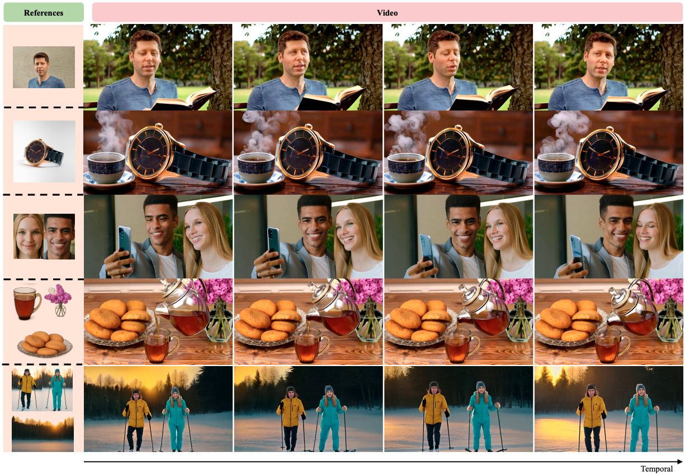
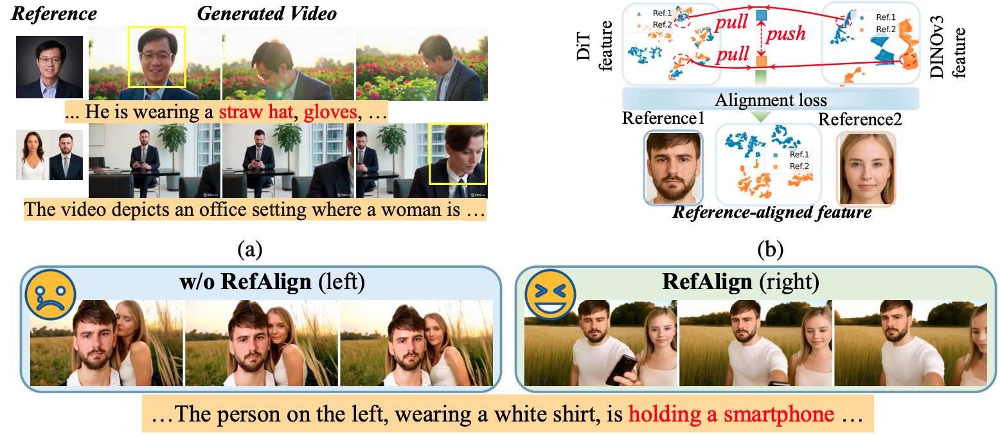
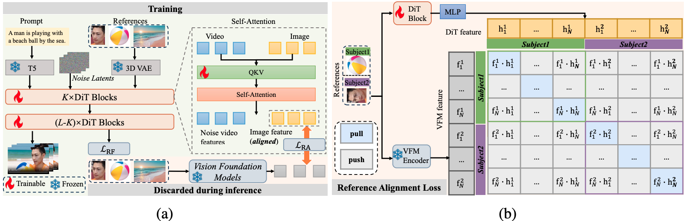
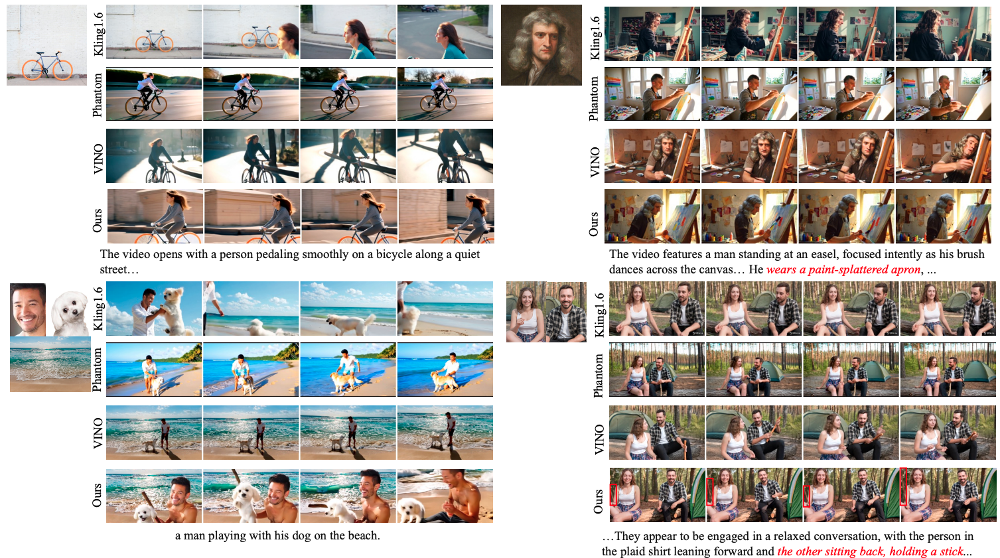
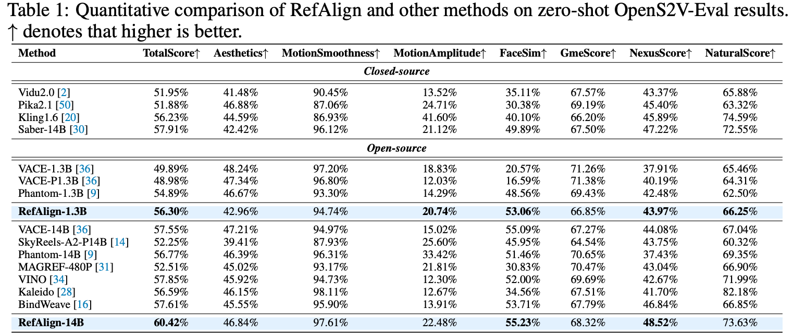

<div align="center">

  <br>
</div>


# 🚀 RefAlign: Representation Alignment for Reference-to-Video Generation

[](https://arxiv.org/abs/2603.25743) [](https://arxiv.org/pdf/2603.25743)  [](https://huggingface.co/gudaochangsheng/RefAlign-1.3B)
[](https://huggingface.co/gudaochangsheng/RefAlign-14B)
[](https://www.modelscope.cn/models/gudaochangsheng98/RefAlign-1.3B)
[](https://www.modelscope.cn/models/gudaochangsheng98/RefAlign-14B)
[](https://github.com/gudaochangsheng/RefAlign)
[](https://gudaochangsheng.github.io/RefAlign-Page/)

<div align="center">
  <a href="https://gudaochangsheng.github.io/">Lei Wang</a><sup>1,2,*,&ddagger;</sup>,
  <a href="https://scholar.google.com/citations?hl=zh-TW&user=1uL_9HAAAAAJ">Yuxin Song</a><sup>2,&ddagger;</sup>,
  <a href="https://github.com/Martinser">Ge Wu</a><sup>1</sup>,
  <a href="https://scholar.google.com.hk/citations?user=pnuQ5UsAAAAJ&hl=zh-CN&oi=ao">Haocheng Feng</a><sup>2</sup>,
  <a href="https://hangz-nju-cuhk.github.io/">Hang Zhou</a><sup>2</sup>,
  <a href="https://jingdongwang2017.github.io/">Jingdong Wang</a><sup>2</sup>
    <a href="https://yaxingwang.github.io/">Yaxing Wang</a><sup>4&dagger;</sup>
    <a href="https://scholar.google.com.hk/citations?user=6CIDtZQAAAAJ&hl=en">Jian Yang</a><sup>1,3&dagger;</sup>
</div>

<div align="center">
  <sup>1</sup> PCA Lab, VCIP, College of Computer Science, Nankai University &nbsp;&nbsp;
  <sup>2</sup> Baidu Inc. &nbsp;&nbsp;
  <sup>3</sup> PCA Lab, School of Intelligence Science and Technology, Nanjing University &nbsp;&nbsp;
  <sup>4</sup> College of Artificial Intelligence, Jilin University
</div>

<div align="center">
  &dagger;Corresponding authors *Interns in Baidu Inc. &ddagger;Equal Contribution
</div>

<div align="center">

  <br>
</div>


## Demo

| Reference Images | Output Video |
|---|---|
|    | <a href="assets/faceobj_1.mp4">faceobj_1.mp4</a> |
|    | <a href="assets/faceobj_2.mp4">faceobj_2.mp4</a> |
|    | <a href="assets/ref3.mp4">ref3.mp4</a> |
|    | <a href="assets/ref4.mp4">ref4.mp4</a> |

---

<div align="center">

  <br>
  <em>
     Motivation of the proposed RefAlign method. (a) The R2V task suffers from copy–paste artifacts (top) and multi-subject confusion (bottom), both generated by Kling. (b) t-SNE
visualization of reference feature distributions. DiT features (conditioned on VAE-encoded inputs)
are highly entangled and overlap substantially across references, whereas DINOv3 features are
more separable. RefAlign aligns DiT features to the DINOv3 feature space via an alignment loss,
improving reference separability by pulling same-reference features closer and pushing differentreference features farther apart. (c) Visual comparison with and without RefAlign.
  </em>
</div>

## 📘 Introduction
Reference-to-video (R2V) generation is a controllable video synthesis paradigm that constrains the generation process using both text prompts and reference images, enabling applications such as personalized advertising and virtual try-on. In practice, existing R2V methods typically introduce additional high-level semantic or cross-modal features alongside the VAE latent representation of the reference image and jointly feed them into the diffusion Transformer (DiT). These auxiliary representations provide semantic guidance and act as implicit alignment signals, which can partially alleviate pixel-level information leakage in the VAE latent space. However, they may still struggle to address copy--paste artifacts and multi-subject confusion caused by modality mismatch across heterogeneous encoder features. In this paper, we propose RefAlign, a representation alignment framework that explicitly aligns DiT reference-branch features to the semantic space of a visual foundation model (VFM). The core of RefAlign is a reference alignment loss that pulls the reference features and VFM features of the same subject closer to improve identity consistency, while pushing apart the corresponding features of different subjects to enhance semantic discriminability. This simple yet effective strategy is applied only during training, incurring no inference-time overhead, and achieves a better balance between text controllability and reference fidelity. Extensive experiments on the OpenS2V-Eval benchmark demonstrate that RefAlign outperforms current state-of-the-art methods in TotalScore, validating the effectiveness of explicit reference alignment for R2V tasks.



<div align="center">
<em>(a) Overview of RefAlign. During training, we apply the proposed reference alignment loss
LRA to intermediate features in selected DiT blocks and align them to target features extracted by a
frozen vision foundation model (VFM). During inference, we discard the alignment process and the
VFM. (b) Illustration of the reference alignment (RA) loss. RA loss aligns DiT reference features
to their corresponding VFM teacher features by pulling matched (same-subject) pairs together and
pushing mismatched (cross-subject) pairs apart, improving reference-consistent generation.
  </em>
</div>

## ✨ Qualitative results

<div align="center">
    <b>
            Quality results compared to other methods.
    </b>
</div>


## 📈  Quantitative results
<p align="center">
 
</p>

## 🏆 OpenS2V-Eval Leaderboard

> RefAlign achieves **state-of-the-art performance** on [OpenS2V-Eval](https://huggingface.co/spaces/BestWishYsh/OpenS2V-Eval) across multiple metrics.

| Model | Venue | TotalScore ↑ | Aesthetic ↑ | MotionSmoothness ↑ | MotionAmplitude ↑ | FaceSim ↑ | GmeScore ↑ | NexusScore ↑ | NaturalScore ↑ |
|---|---|---:|---:|---:|---:|---:|---:|---:|---:|
| 🥇 **RefAlign-14B (Ours)** | Open-Source | **60.42%** | 46.84% | **97.61%** | 22.48% | **55.23%** | 68.32% | **48.52%** | 73.63% |
| 🥇 **RefAlign-1.3B (Ours)** | Open-Source | **56.30%** | 42.96% | 94.74% | 20.74% | 53.06% | 66.85% | 43.97% | 66.25% |
| Saber | Closed-Source | 57.91% | 42.42% | 96.12% | 21.12% | 49.89% | 67.50% | 47.22% | 72.55% |
| VINO | Open-Source | 57.85% | 45.92% | 94.73% | 12.30% | 52.00% | 69.69% | 42.67% | 71.99% |
| BindWeave | Closed-Source | 57.61% | 45.55% | 95.90% | 13.91% | 53.71% | 67.79% | 46.84% | 66.85% |
| VACE-14B | Open-Source | 57.55% | **47.21%** | 94.97% | 15.02% | 55.09% | 67.27% | 44.08% | 67.04% |
| Phantom-14B | Open-Source | 56.77% | 46.39% | 96.31% | **33.42%** | 51.46% | **70.65%** | 37.43% | 69.35% |
| Kling1.6 | Closed-Source | 56.23% | 44.59% | 86.93% | **41.60%** | 40.10% | 66.20% | 45.89% | **74.59%** |
| Phantom-1.3B | Open-Source | 54.89% | 46.67% | 93.30% | 14.29% | 48.56% | 69.43% | 42.48% | 62.50% |
| MAGREF-480P | Open-Source | 52.51% | 45.02% | 93.17% | 21.81% | 30.83% | 70.47% | 43.04% | 66.90% |
| SkyReels-A2-P14B | Open-Source | 52.25% | 39.41% | 87.93% | 25.60% | 45.95% | 64.54% | 43.75% | 60.32% |
| Vidu2.0 | Closed-Source | 51.95% | 41.48% | 90.45% | 13.52% | 35.11% | 67.57% | 43.37% | 65.88% |

## 🏋️  Training

### 🛠️ Installation
```shell
# git clone this repository
https://github.com/gudaochangsheng/RefAlign.git
cd RefAlign

# create new anaconda env
conda create -n refalign python=3.8 -y
conda activate refalign

# install python dependencies
pip3 install -r requirements.txt
  ```

### 🎯 train
```shell
# Train RefAlign in stage1 (OpenS2V)
sh ./examples/wanvideo/model_training/full/Wan2.1-T2V-1.3B_stage1.sh

# Train RefAlign in stage2 (Phantom-Data)
sh ./examples/wanvideo/model_training/full/Wan2.1-T2V-1.3B_stage2.sh

# Train RefAlign in stage1 (OpenS2V)
sh ./examples/wanvideo/model_training/full/Wan2.1-T2V-14B_stage1.sh

# Train RefAlign in stage2 (Phantom-Data)
sh ./examples/wanvideo/model_training/full/Wan2.1-T2V-14B_stage2.sh
  ```

## 📦 Model Weights

| Model | Params | Hugging Face | ModelScope |
|---|---:|---|---|
| RefAlign-1.3B | 1.3B | [](https://huggingface.co/gudaochangsheng/RefAlign-1.3B) | [](https://www.modelscope.cn/models/gudaochangsheng98/RefAlign-1.3B) |
| RefAlign-14B | 14B | [](https://huggingface.co/gudaochangsheng/RefAlign-14B) | [](https://www.modelscope.cn/models/gudaochangsheng98/RefAlign-14B) |

## 🎬 Inference


```shell
# Inference RefAlign-1.3B
python examples/wanvideo/model_inference/Wan2.1-T2V-1.3B_subject.py

# Inference RefAlign-14B
python examples/wanvideo/model_inference/Wan2.1-T2V-14B_subject.py
  ```
## Citation

If you find WaDi useful, please consider giving our repository a star (⭐) and citing our [paper](https://arxiv.org/abs/2603.25743).

```
@article{wang2026refalign,
  title={RefAlign: Representation Alignment for Reference-to-Video Generation},
  author={Wang, Lei and Song, YuXin and Wu, Ge and Feng, Haocheng and Zhou, Hang and Wang, Jingdong and Wang, Yaxing and others},
  journal={arXiv preprint arXiv:2603.25743},
  year={2026}
}
```
## Acknowledgement

This project is based on [DiffSynth-Studio](https://github.com/modelscope/DiffSynth-Studio). Thanks for their awesome works.
We sincerely acknowledge the excellent and inspiring prior work, [Phantom](https://github.com/Phantom-video/Phantom), [VINO](https://sotamak1r.github.io/VINO-web/), [OpenS2V](https://github.com/PKU-YuanGroup/OpenS2V-Nexus), [Phantom-Data](https://phantom-video.github.io/Phantom-Data/) and [Wan2.1](https://wan.video/).
## Contact
If you have any questions, please feel free to reach out to me at  `scitop1998@gmail.com`. 
